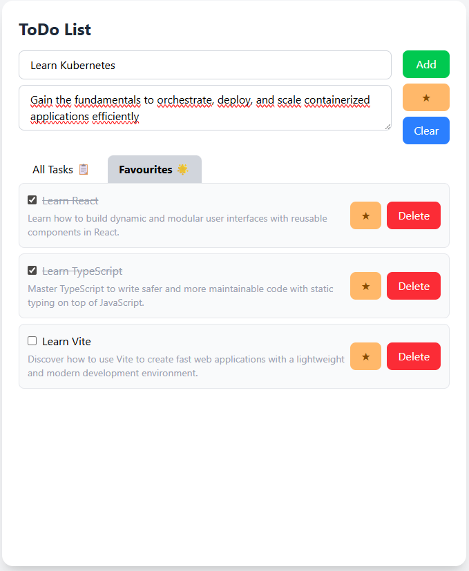

# Technical Test: Todo App

**ToDo List** application developed with FastAPI (backend) and React + TypeScript + Vite + Tailwind (frontend).
It allows you to manage tasks with titles, descriptions, and favourites ⭐, saving them in a JSON file.

## 🚀 Technologies

- **Backend**: [FastAPI](https://fastapi.tiangolo.com/) (Python 3.11+)
- **Frontend**: [React](https://react.dev/) + [TypeScript](https://www.typescriptlang.org/) + [Vite](https://vitejs.dev/)
- **CSS**: [TailwindCSS](https://tailwindcss.com/)

## ✨ Features

- Create tasks with **title** and **description**
- Mark as **completed** ✅
- Mark as **favourites** ⭐ and list them separately
- Delete tasks 🗑️  
- UI with **All Tasks / Favourites** tabs  
- List with **internal scroll** when it exceeds the height of the container

## ⚙️ Installation and execution

1. Create a virtual environment and install the dependencies for the backend:

   ```bash
   cd backend
   python -m venv .venv
   source .venv/bin/activate  # On Windows use `.venv\Scripts\activate`
   pip install -r requirements.txt
   ```

2. Install the dependencies for the frontend:

   ```bash
   cd frontend
   npm install
   ```

3. Run the application:

   ```bash
   npm run dev
   ```

4. Open your browser and navigate to `http://localhost:5173` to see the application.

- Frontend: http://localhost:5173  
- Backend:  http://localhost:8000  
- Docs API (Swagger): http://localhost:8000/docs

5. Start using the app

## 🔧 Requirements

- **Python** 3.9+ (3.11 recommended) 
- **Node.js** 18+ (Node 20 LTS recommended) y **npm**  
- (Optional) **virtualenv** to isolate Python dependencies

## 🧪 Tests

The repo includes `mainTest.py` with endpoint tests using `TestClient`.  
To run them (if you add `pytest` to dependencies):

```bash
pip install pytest
pytest
```

Then you just need to call pytest and the test file for the test to start running.

```bash
cd app
pytest mainTest.py
```

## 📁 Project structure

```
TechnicalTest/
├─ backend/
│  └─ app/
│     ├─ main.py                  # FastAPI and CORS configuration
│     ├─ routes/todo_routes.py    # Endpoints REST
│     ├─ models/todo.py           # Pydantic Models
│     ├─ services/todo_service.py # Read/save JSON
│     └─ data/todos.json
│  └─ requirements.txt
│
├─ frontend/
│  ├─ src/
│  │  ├─ api/todo.ts              # Calls to the API
│  │  ├─ components/              # UI: Form, List, Item, Tabs
│  │  ├─ types/todo.d.ts
│  │  └─ App.tsx / main.tsx
│  ├─ package.json
│  └─ vite.config.ts
│
├─ images/                        # Includes the images for the Readme
├─ INSTRUCTIONS.md                # Instructions for completing the task
└─ README.md  ← (este archivo)
```

## 🔚 Endpoints

| Method | Path                 | Body (JSON)                                      | Reply     |
|-------:|----------------------|--------------------------------------------------|-----------|
| GET    | `/todos`             | —                                                | `Todo[]`  |
| POST   | `/todos`             | `{ "title": string, "description": string, "favourite": boolean }` | `Todo` |
| PATCH  | `/todos/{id}`        | **Parcial**: `{ "completed": boolean }` ó `{ "favourite": boolean }` | `Todo` |
| DELETE | `/todos/{id}`        | —                                                | `200 OK`  |

> The `PATCH /todos/{id}` accepts **partial updates**. Send only the field you want to change (`completed` or `favourite`).

## 🖼️ Examples of use

<p align="center">


</p>

<p align="center">


</p>
